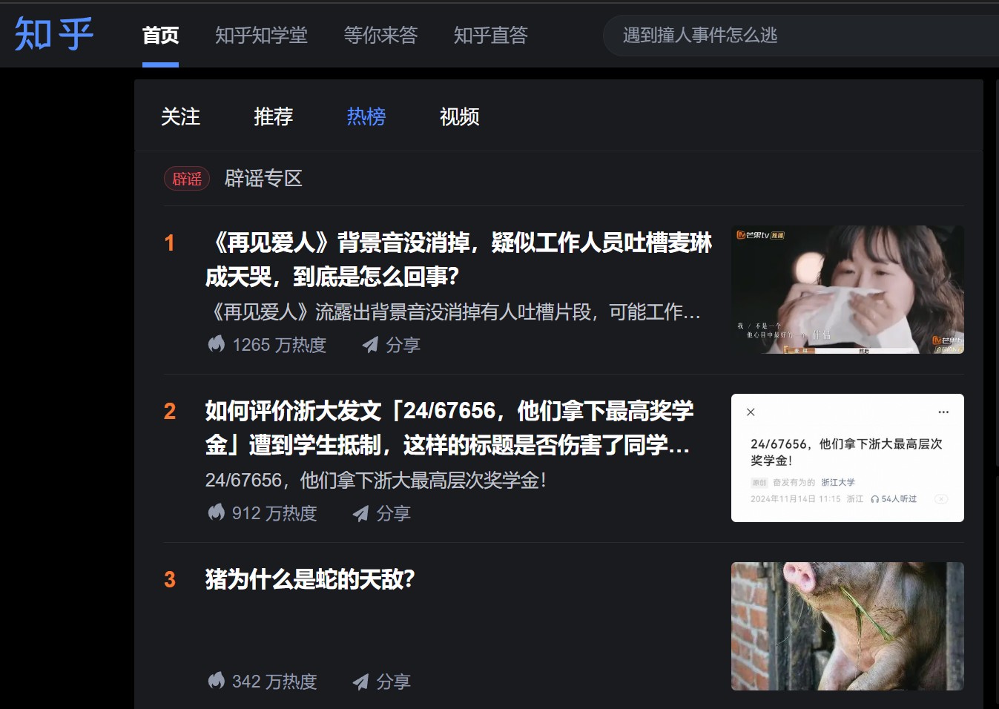
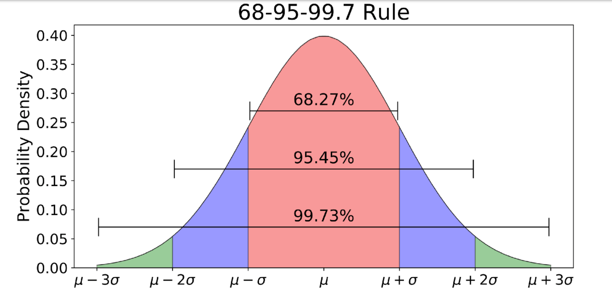

# The Twenty-Four-Body Problem 二十四体

我用 LLM 生成 + 手工修改，结合时事，致敬《三体》，完成一个关于浙大的科幻故事。希望大家喜欢。

<!-- more -->

话说在太阳系，有一颗星球的条件恰到好处：它稳定运行在公转轨道上，到恒星太阳的距离适中，表面温度适宜；这颗星球本身的大小适中，重力适宜；大气层厚度适中，使得这颗星球的表面不会被宇宙射线灼伤……这颗星球就是浙大星，因为这许多巧合的叠加，它极端宜居的表面理所当然地产生了智慧生命。这些生命在浙大星上过着平淡的生活，认真经营自己生命的每一天。

但并不是只有稳定的宇宙空间才有生命，浙大人熟悉的生活正在被来自混沌的、更强大的文明入侵……

## 一、正态分布计划

张献忠来自浙大星一个人口众多，物质条件却非常匮乏的地区，那里的人们都指望着通过考学来改变自己的命运。张献忠也是这样，他从入学衡 * 中学附幼儿园的第一天起就保持着极端自律的作息，18 小时学习，1 小时运动，5 小时睡眠，日日如此。他的努力没有白费，他一路考入了衡 * 中学附小、衡 * 中学附初中、衡 * 中学本校，最后<del>猝亖了</del>在高考中取得了优异的成绩，被浙大星顶级学府“浙江大学”的航空航天专业录取。

在长期高压的教育环境下被灌输优胜劣汰的思想，张献忠对理工科的知识信手拈来、融会贯通，即使在群英荟萃的浙江大学也依然是不折不扣的学霸。但他的社会化程度很低，对待他人冷若冰霜，而且经常在校园论坛 CC98 上在抱怨学业压力大的帖子下留言：“还不是因为你不够努力？”

博士毕业后，张献忠被分配进了浙大星的航天局，成为了一名高级工程师。浙大星总体上是一个发达的高福利社会，社会保障好得白里透红，所以虽然张献忠的工作环境很棒，“博士”的头衔也让他备受人们景仰，但他的税后工资并没有很高，也没有处处压人一头的权力。张献忠对这种情况很不满，他在成长过程不断验证成立的信条是“人之生矣有贵贱，贵人长为天恩眷”，而他极尽努力得到的结果竟然是人人平等的富足生活，这让他极其不满。看着他的同事们到工位后泡一杯美式咖啡，白天开心地钻研自己热爱的航天事业，下班后打打 Apex，他心中无比愤懑：“这些人怎么可以这么惬意地生活？”

这一天，张献忠在航天局的办公室里，看到示波器上出现了一个奇怪的信号，接收到了宇宙深处一段不同寻常的电磁波。他的同事们都在忙着自己的事情，没有人注意到这个信号。张献忠心中一动，他认为这是一篇潜在的《Nature》，决定独自调查这个信号的来源。

经过细致的研究，张献忠掌握了解码这种信号的方法。他发现这段电磁波的波动模式当成声波处理，竟然可以播放出类似人类语言的声音。这段语音中描述了一颗遥远的星球上的生活，这个星球的文明水平远远超过了浙大星，他们的科技发展到了一种无法想象的程度，并且最重要的是，那里的人们都以张献忠理想的态度生活着：他们的社会是一个社会达尔文主义乌托邦，那里的外星人们相信社会中人的能力是服从 __正态分布__ 的，只有无情地筛除那长长的拖后腿的尾端，人们才有努力生活的动力，社会才能够进步。

作风严谨的张献忠当然也发现了，只要将这段电磁波经过傅里叶变换，将频域较上方的部分平移下来，再经过傅里叶逆变换，当成声波处理，就可以播放出另一端音频：“不要回答，不要回答，不要回答！”

但，怎么可能不回答呢？张献忠没有犹豫，用同样的格式编码了一段回答，向信号的来源发出了回应：

“我们的坐标是……浙大人已经不可能依靠自身的力量解决自己的问题了，请到我们的星球来，救赎我们。”

## 二、工程学不存在了

浙江大学鸟语学院，萧老虎走进了计算语言学研究员袁猫咪的办公室：“袁研究员，你好。最近是否有一个叫‘工程边界’的组织联系过你？”

袁猫咪从电脑前抬起头，看了看萧老虎，疑惑地问：“请问您是？”

萧老虎出示了自己的证件：“我是警方派来的。这个组织最近有一些不正常的活动，我们监听到他们向你发送过邮件，希望你配合调查。”

袁猫咪有些不满，就这样走进别人的办公室，而且还说自己一直监听着他的邮件，听着也太 creepy 了。但是出于对警方的尊重，他还是打开了自己的邮箱，找到了那封邮件：“还真有，被我训练的垃圾邮件识别器给判定成民科发的骚扰邮件了，所以我一直没看到。”

“很好，那么请你跟我走一趟，我们需要你的协助。”萧老虎说。

两人坐着太空电梯，来到了一个地方。这里似乎是一个行政中心，各种设施杂乱地堆在地上，文职人员们忙碌地处理着各种事务，看表情似乎都很焦急。

袁猫咪一边走着，环顾了一圈四周，然后看向萧老虎，问：“这是什么地方？我可以知道吗？”

萧老虎说：“这是派大星，你还没来过吧？”

袁猫咪问：“派大星？这是什么地方？我只知道浙大有蟹老板。”

萧老虎摊开手：“我们早就不在浙江大学了。派大星是我们浙大星的一颗人造卫星，一些非常重大的机密事务在浙大星上交流怕隔墙有耳，就都在这里处理。”

萧老虎带着袁猫咪走到了一个房间前，敲了敲门，一个穿着警服的人走了出来：“你们来了，快进来吧，会议要开始了。”

萧老虎拉着袁猫咪在一张桌子前坐下，桌子周围已经坐着一群人了。这群人看起来都很严肃，有的人在看着电脑屏幕，有的人在翻阅文件，有的人在交谈。在会议中，袁猫咪听到了一些关于“工程边界”的信息。原来最近有很多工科研究者的科研都由于各种奇怪的理由推进不下去，不久之后这个组织就会联系他们。在与这个组织的接触中，他们可能会陷入癫狂的绝境，认为工程学是不可能的，自己皓首穷经一生所追求的答案根本不存在；但也有一些人会被这个组织的理念所吸引，加入他们的行列，从事一些可疑的活动。这一次警方在袁猫咪刚刚被这个组织联系的时候找上了门，就是希望袁猫咪能够作为他们的内线，帮助他们了解这个组织的真实情况。

会议的主持人说完了这些信息，然后看向袁猫咪：“袁研究员，你愿意帮助我们吗？”

袁猫咪看了看周围的人，举起了手：“我有疑问。之前自杀的那些人，真的是自杀吗？不是‘被’自杀之类的……”

主持人点点头：“这个您大可相信我们的心理咨询和法医技术，他们就是因为怀疑工程学的可能性而自杀的，不是被这个组织所害。并且，我们还会派萧警官保护您的安全，他曾经荣获……”

袁猫咪思考了一会，又问：“我还有一个疑问，你们为什么要找我？你们认为我不会自杀吗？”

主持人笑了笑：“因为您研究的领域特殊，是计算语言学。这样的工科本身就是一个无法解决实际问题、靠讲故事维持自身存在的大骗局了，您应该已经习惯了自己的研究毫无价值。所以相信面对这个组织的思想灌输时，您的内心世界不会像其他工程学研究者那样容易崩塌。”

袁猫咪一拍桌子，站了起来：“您不能这么说我们 AI！我们的研究是有意义的，这门学科虽然还欠缺一些可解释性，但是我们的研究成果已经在很多领域得到了应用，解决了很多实际问题！我们只是需要一些时间，让基础理论的研究追上工程实践……”

主持人打断了袁猫咪的话：“是的，我们没有质疑 AI。事实上，我们还没有试图联系过从事 AI 研究的人来帮助我们执行这次任务。”

袁猫咪：“不是说没有联系 AI 研究者吗？为什么我在这？”

主持人：“因为 __ACL is not an AI conference__。”

袁猫咪：“……”

最后袁猫咪还是接下了这个任务。他和萧老虎乘坐太空电梯回到了浙大星，打开了那份邮件，回信称愿意加入“工程边界”组织。不久之后，袁猫咪收到了一份包裹，里面是一个移动硬盘，装着一个叫做“二十四体”的程序。为了防病毒，他新开了一个虚拟机运行了这个程序，发现这原来是一个 VR 游戏，最多支持三人一起进入游戏的世界。于是他打电话让萧老虎买了两幅 VR 眼镜过来，两人一起进入了这个游戏。

## 三、黑暗史诗：24 吞没 67656

进入游戏，两人眼前升起字幕：“欢迎来到二十四体的世界。请玩家尽情探索这个世界，找到太阳运行的规律，解开这个世界的秘密。”

字幕落下，正式进入游戏的世界，他们遇到了一个披着兽皮衣的男人。两人尝试和这个角色互动，惊讶地发现这个角色竟然会说话：“你们好，我是后羿，我是这个世界的守护者。”

“你好你好！”萧老虎急切地回应，“既然你是这个世界的守护者，那你知道这个世界的太阳是怎么运行的吗？”

见两人是初来乍到，后羿便耐心地向他们解释了起来。原来，这个世界不止有一个太阳，并且每个太阳的运行都是不规则的，连带着他们星球的日夜也长短不一。当太久没有太阳升起时，这个世界就是天寒地冻的极夜，而当有超过三个太阳同时升起时，这个世界就会被烧毁。

“而我，作为这个世界的守护者，职责就是在有超过三个太阳同时升起的时候，用我的神弓射下多余的太阳，保护这个世界。”后羿说完，又向两人展示了他的神弓，一副看起来普通的弓箭，但是箭矢上却镶嵌着一颗闪烁着光芒的宝石。袁猫咪心里觉得这不可能，但想想可能是这个世界的什么设定，也就没说什么。

这时，天空突然亮得有些过头，两人抬头一看，发现天空中出现了十个太阳。

后羿立刻拿起了他的神弓，拉满了弓弦，瞄准了其中一个太阳，然后放开了箭矢。箭矢飞向了太阳，然后……什么也没有发生，太阳依然在天空中照耀着。“怎么回事？”后羿有些慌乱，又拉起了弓，再次射向了太阳，但是依然没有任何效果。

“我知道了，肯定还得……还得搭配咒语和仪式才行！”后羿说着，又开始念起了咒语，跳起了萨满的舞蹈。

“我也知道了，原来你就是个神棍。”袁猫咪毫不留情地说了出来。

天上的十颗太阳越来越亮，地面上的温度也越来越高，两人感到了一阵灼热，然后眼前一黑，又浮现出这样的字幕：“第一代文明在十日凌空中被阳光烧毁，这一次，文明发展到了萨满巫术水平。”

两人摘掉了 VR 眼镜，回到了现实世界。

“是不是结束得太快了？再来？”萧老虎问，一边盯着自己手上神奇的机械出神。

当然。第一次游戏中，他们只是了解了二十四体世界的一些基本现象而已，没收集到足够的信息，更没有办法理解这些现象背后的机理。而且作为一名受过现代科学教育的浙大人，袁猫咪看着第一次二十四体游戏中，后羿居然用玄学方法解决物理问题，看在眼里急在心里，现在还在难受呢。

袁猫咪和萧老虎对视了一眼，然后一起点头，再次戴上了 VR 眼镜。

第二次游戏，两人出现在了战国时期。这一次，他们遇到的是墨子，他正在教室里向他的弟子们讲授他面前一台复杂的机械：“外面的一层铜壳是天球，而中心的小方块是我们生活的大地。天球上有大小不同的洞，外面有火焰在烤，火光透过洞口照在大地上，就是日月星辰。这个机械是我们的世界的缩影，是我们的世界的模型……”原来，这一时期的人们开始摒弃玄学，用哲学的思辨来解释世界了。

“虽然他们建立的模型跟现实天差地别，但只要开始用理性的方法思考，就是一种进步。”袁猫咪捋了捋自己的胡子，这样评价道。

这时，天空中出现了十二个光点。“不好，超过三个太阳，要世界末日了，快跑！”萧老虎大叫着，拉着袁猫咪就往这栋教学楼的防空洞跑去。但是，可能是因为太阳比第一轮游戏的时候更多，他们还没跑到防空洞，就和互相推搡着的师生们一起被炽热的空气烤死了。

第三次游戏，两人出现在了中世纪的欧洲。这一次，他们坐在宗教法庭上，看着布鲁诺为自己辩护。

宗教领袖愤怒地斥责布鲁诺：“Big 胆异端，敢质疑上帝的创造轰！”

布鲁诺却不屈不挠：“清者自清，妹妹不素异端惹，素科学家厚。妹妹无意对抗上帝，但素本可人儿的理论在解释太阳运动的时候得到了很多很好的评价……”

萧老虎听到这一幕直接石化了，他看着袁猫咪：“你听得懂他们说的是什么语言吗？”

袁猫咪摇摇头：“不完全懂，我们鸟语学院只研究鹰语和鹅语。但我能猜到他们在说什么，大概就是，布鲁诺是一个科学家，他的理论在解释太阳运动的时候得到了很好的结果，但是他的理论与教会的教义相悖，所以他被指控为异端。”

“给我婷芷，地心说的同心球、本轮还解释不了太阳的运动厚？！要你这种 nbcs 的路人甲造新学说？”法官拍了一下桌子，大声质问，“而且你说淋王星不是宇宙的中心，__天上有二十四颗太阳__，那怎么解释我们最多只能观测到十二颗太阳同时存在厚？”

这时，天气突然燥热了起来。“姐妹，大事不妙噜，有超过三颗太阳，不努力逃跑就去鼠！”从宗教法庭外跑进来一个仆人，大声喊道。

“珍素大难淋头惹，怎么有 13 颗太阳？”宗教领袖们跑到户外，看到了天空中的景象，纷纷惊呼，“举头三尺有神淋，要被吸入噜！”

“我们怎么办？”袁猫咪问。

“要不我们也跑？”萧老虎提议。

“我们留下来，看看这个世界会怎么样吧。反正游戏里又不会真死。”袁猫咪说。

天上的太阳越来越多，最后正如布鲁诺所说，停止在了二十四颗。然后，只见其中一颗太阳越来越大，覆盖了一整个天空，整个世界都被烧毁了。袁猫咪和萧老虎的灵魂离开了游戏里的肉体，回到了现实世界。

第四次游戏，两人出现在了现代社会。这一次，他们见到了黄仁勋，他正在向 NASA 的官员推销他的高性能 GPU。

“这款 GPU 代表目前我司科技的最高水平，”黄仁勋说，“您知道，自从淋王星被 23 号太阳吞没后，我们卷王星就把计算太阳轨迹的问题列为了头等大事。这款 GPU 专门为科学计算设计，可以在短时间内完成大量的微分方程求解，帮助您和您的下属更好地理解太阳系的运行规律……”

萧老虎扯了一下袁猫咪的衣袖：“这个世界是不是达到我们现实世界现在的科技水平了？”

袁猫咪点点头：“看来是的。你平时游戏没少玩吧？”

“是的，这件事确实非常要紧。”NASA 的官员点点头，“我们会考虑购买这款 GPU 的。”

尴尬地沉默了一会，NASA 的官员又开口：“不过，请原谅我咬文嚼字，我们并没有办法理解太阳系的运行规律。因为我们的基础学科一直停滞不前，现在我们用来计算太阳轨迹的方法其实和早期的天气预报技术差不多。”

“建立观察站，实时测量数据，并且用微分方程建模粗略求解是吗？”黄仁勋从容地笑着，“没事，不关心，反正我们的 GPU 总能帮到你们。”

此时，天上的太阳突然变得异常明亮。在场的所有人都抬头看向天空，明明只有一颗太阳，但是它的光芒却像二十四颗太阳加起来一样耀眼。更可怕的是，地表的万物都被强大的引力吸起，向太阳飞去，然后在半空中燃烧。

“诶不是，我们怎么死了？不是只有一颗太阳吗？”萧老虎看着自己的手臂被烧焦，惊恐地大叫。

“不，那不是一颗太阳，那是……二十四颗太阳叠在一起啊！”那位 NASA 的官员发出了最后的呐喊。

第五次游戏，两人所到达的时间终于变成了现在。这一次，他们遇到了埃隆·马斯克。他正戴着一顶 MAGA 的鸭舌帽，站在舞台上兴致高昂地宣讲 SpaceX 最新的星际移民计划。

原来，随着基础科学的进步，卷王星的科学家们终于揭开了二十四体的面纱，发现了这个世界的真相。原来，他们所生活的星系有 24 颗恒星，而只要是超过三体的问题，都没有办法用解析方法求解。他们所生活的星系是一个混沌的世界，只有通过数值模拟去粗略地估计太阳的轨迹。

并且更糟糕的是，他们的天文学家发现，二十四体星系最开始有 __67656 颗行星__ 在各自的轨道上运行着，灿若星辰；但他们卷王星和淋王星人的人文历史所记载的加起来，也只有 __天王星、卷王星、淋王星__，一共三颗行星。天王星不知所踪，一直被以为只是远古先民的幻想；而淋王星则是在中世纪科学家众目睽睽的观测下一头扎进了 23 号太阳，给卷王星剩下大批淋语母 0 难民；其他的行星，都在二十四体星系的混沌引力场中，或碰撞，或被太阳吞没，或被甩出二十四体星系，最终都化为了星尘。

但幸运的是，他们观测到了在宇宙空间的深处，有一个更加宜居的星系。它在银河系的一根螺旋臂上，只有一颗恒星，而且边上有一颗条件非常适宜的行星在稳定的轨道上运行着。他们决定，要将自己的文明迁移到这个星系，建立新的家园。

萧老虎看着马斯克的屏幕上显示的图像，有些惊讶：“那是……”

“是的，那是浙大星。”袁猫咪说。

游戏黑屏，字幕升起：“二十四体的历史回顾到此结束。二十四体星系的文明将迁往浙大星，开始新的生活。身为浙大星的原住民，如果您愿意协助二十四体文明降临浙大星，那么您与我们‘工程边界’便是志同道合之人，请……”

## 四、古神计划

原来“工程边界”组织的目的是协助二十四体文明征服浙大星。结束了第五次游戏，袁猫咪和萧老虎立刻回到派大星，向总部汇报了这个重要的信息。总部立即派人行动，抓捕了“工程边界”负责发邮件联系工程学家的幕后黑手张献忠，将他带到了派大星上。

“不是，这快得有点过头了啊。”在单向玻璃后，袁猫咪看着张献忠被带进审讯室的情景，有些不知所措。

“整个互联网都被咱喵监听着呢，开盒一个小坏蛋的 IP 地址还不是小菜一碟 ~⭐”网安部门的技术人员 wink 了一下。

经过审讯，张献忠交代了他的罪行和计划。他只是“工程边界”的创始人和核心成员之一，跟其他核心成员交流时会使用移动硬盘之类的设备来储存信息，然后通过各种物流手段传递。至于和工程学家联络，他以为只要用自己的 IP 和域名发邮件就安全了，没想到真会有人顺着网线找上门。而现在，正有一份重要的机密文件装在移动硬盘里，放在“审判者”号邮轮上，等着被送过口岸。船上有大量护卫分散在各处，还有专人在一个密室里看管着这个移动硬盘，只要发现有人闯入，就会立刻销毁硬盘，不让“工程边界”核心成员之间发送的信息暴露给外界。

这听起来确实是个棘手的问题，如果行动不够迅猛的话硬盘就会被“工程边界”安排的守卫销毁，但如果大范围攻击的话又怕误伤到不知道在船上什么地方的硬盘。

“如果看守移动硬盘的是人的话，我倒是有一个办法。”袁猫咪扶着下巴思考，“阿米诺斯共和国境内有一种传统的宗教语言，叫做‘古神语’。这种语言的音系很特别，某些超音段成分会使得声波和听者的大脑组织共振，从而产生催眠甚至脑震荡的效果。”

“所以，只要我们在口岸播放这种语言的音频，看守移动硬盘的人就会昏迷，我们就可以顺利拿到这个硬盘，不让它被毁掉了？”萧老虎问。

“是的。那一天离口岸近的工作人员要记得戴好耳塞和头盔，以免自己也受到声波影响。”袁猫咪说。

萧老虎拍了一下手：“难怪你们语言学家要保护濒危语言，原来还有这种用途。”

终于，审判者号从公海慢慢驶向口岸。袁猫咪和萧老虎在岸边等待着结果，警方的工作人员盯着监控的屏幕。在那艘巨大的邮轮完全进入领海区域后，警方果断地按下了播放按钮，岸上特意重新安装的扬声器阵列播放出了古神语的音频：“阿妈波比是我爹，啊米浴说的道理……”

只见甲板上正在扫地的船员脚下一软，倒在了地上。见到这一幕，警方立刻派出了特警队员，他们穿着防护服，手持电棍，迅速登上了船。经过仔细搜寻，他们在船的一个角落里找到了那个移动硬盘，完好无损地将它带回了岸上。

## 五、你们是虫子

经过解密，警方成功从这块硬盘中得到了“工程边界”组织的所有信息，完全理解了事件的来龙去脉。

原来，二十四体文明的科技高度发达，尤其擅长高精度地发射电磁信号。在寻找星际移民的目标时，除了用太空望远镜、深空探测器等设备去看之外，还尝试了向全宇宙能探测到的行星发射电磁波信号，希望寻找到其他有文明存在的宜居星球。当时负责向银河系这个方向发射信号的工作人员本人很厌恶卷王星这种残酷的文明，认为这样的文明进行星际殖民将是全宇宙的灾难，所以在发射信号的时候特意往频域的高频区域加入了“不要回答”的信息，希望这个信号不会被回应。没想到张献忠恰好非常厌恶浙大星的文明，而向往二十四体星系的文明，所以他接收到这个信号后立刻回应了

张献忠的回应引起了二十四体文明的注意，他们开始和张献忠联系，希望他能够帮助他们征服浙大星。同时，他们还让张献忠建立起了“工程边界”组织，希望通过这个组织的力量在浙大星培养一些顺从二十四体文明的精英，让他们成为内应，方便在二十四体文明征服浙大星后快速建立起一个新的秩序。至于浙大星的工程研究受阻，那在他们看来只是随手的事，他们有办法分析从浙大星传播到卷王星的光，监控浙大星表面所有人的一举一动，也可以发射一点信号干扰浙大星的电子设备，让浙大星的工程研究者们在研究中遇到各种奇怪的问题，这样就钳制住了浙大星的技术发展。

“所以，我们现在在这个星球上做的一切，都是被他们监视着的？”萧老虎问。

“也许是的，以后我们就没有秘密可言了。”袁猫咪回答。

突然，大街上传来尖叫声：“快看外面！”“天哪，那是什么？”“天上怎么有字？”

袁猫咪和萧老虎走到窗前，看到了天空中出现的字幕：“你们是虫子。”发光的字幕在天空中闪烁着，不断重复，铺满了整片天空。

这之后，二十四体人似乎切断了和浙大星的联系：天空中的字幕消失了，“工程边界”的人在被捕后发射向二十四体的信号都没有回信，科技的发展也依然被封锁着。

## 尾声：我们灿若星辰

又是不需要科研的一天，袁猫咪给学生们上课，无精打采地读 PPT 讲二十年前的“新”技术，然后回鸟语学院的办公室打 Apex，一直打到傍晚。晚霞在天边燃烧，暖黄的光透过窗玻璃洒进办公室，晒得袁猫咪懒洋洋的。

突然响起了敲门声，萧老虎走了进来：“老战友，听说你意志有点消沉？”

尽管袁猫咪不太愿意，但萧老虎还说连哄带骗地把他劝出了办公室，说开车载他去兜风，转换一下心情。

等他们开到目的地的时候天已经黑了。袁猫咪下了车，看周围杂草丛生，而且还有池塘，就穿上了防晒服防蚊子咬。

“天都黑了你带我来这种地方，要不是我跟你熟，我都要以为你想灭我口了。”袁猫咪说。

“不骗你，这里晚上可以看星星，市区光污染严重可看不到。”萧老虎拍了一下袁猫咪的肩膀。

随着夜色的加深，天空中的云朵渐渐散去，露出了一片深蓝。起初，只有几颗最亮的星星在天际闪烁，像是在试探着夜色的深浅。但随着时间的推移，越来越多的星星开始点缀在这片天幕上，它们或明或暗，或近或远，像是无数颗散落在黑色天鹅绒上的钻石，静静地散发着柔和的光芒。而地面上，随着夜的沉寂，竟然有萤火虫开始活跃起来。它们在草丛中、池塘边轻盈地飞舞，尾部的荧光一闪一闪，仿佛是地上的星星，与天空中的星辰遥相呼应。这些小小的光点在黑暗中跳跃，时而聚集成群，时而又分散开来，像是在进行一场无声的舞蹈。

袁猫咪和萧老虎找了一块干净的草地并排坐下，仰望着星空。袁猫咪的心情似乎也被这宁静的夜晚所感染，他的眼神逐渐柔和，嘴角不自觉地上扬。他伸出手指，轻轻地在空中划过，似乎想要触摸那些遥远的星星，或者近在咫尺的萤火虫。萤火虫在他们周围飞舞，偶尔有一两只飞过他们的眼前，留下一道短暂而明亮的轨迹。袁猫咪伸出手，一只萤火虫轻轻地落在他的指尖，它的光晕与天上的星光交相辉映，仿佛是大自然赋予的小小奇迹。

萧老虎突然开口：“你看，这些萤火虫像不像我们？”

袁猫咪愣住了：“你思维很少这么跳跃。”

萧老虎微笑：“二十四体人不是说我们浙大人是虫子吗？”

“虽然我们不如他们那样强大，但我们都认真地经营着自己的小生活，为自己热爱的人和事业奉献年华。”

“就像这萤火虫一样，即使在最深刻的绝境也凭自己脆弱的身躯将光芒传承了下来，活过了不知道多少个地质年代，一直到今天都还在继续发光，灿若星辰！”

袁猫咪看着萧老虎，陷入了沉思。过了一会，他抬头看向天空，轻声自言自语：“也许是的，面对二十四体人，我们能做的事情还有很多……”
