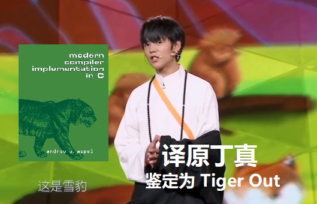

# MAMA 省的大 MA 农

之前把计院之子的故事写成了女频爽文，没想到浙大又频频爆出新瓜，个个都是顶级的小说素材。为保证对称性，这一次我准备把 MIT 之女的故事写成男频爽文。我不确定男性观众看了爽不爽，反正我自己是写爽了。

<!-- more -->

## 序章

爷爷年事已高，即将寿终正寝。我守在他的床前，握着爷爷的手。我知道死亡是一切生命必然的结局，纵然不舍也只能默默接受这个事实，眼睁睁看着我最后的亲人一点点逝去。

爷爷的手颤颤巍巍地拿出了一封信，递给我：“小圆，这是我给你最后的礼物，但现在还不是拆开它的时候。等到有一天，如果你的内心被现代生活压垮，你就可以打开这份礼物了。”

说完这些，爷爷永远地闭上了眼睛。我只是个穷学生，只能用奖学金给爷爷办了一场朴素的葬礼。

这之后，我离开了伊利诺伊老家，回到了我从小生活的麻省，继续学业。即便孑然一身，我也会在危机四伏的世界中勇敢地生存下去。

## 从大蓝鹰到 MIT，我都做对了什么

我是美国华裔，从小被父母从伊利诺伊老家带来麻省（Massachusetts，简称 MA），算是外来务工子女。我一路读 MA 的公立小学、初中、高中，最后在大蓝鹰职业技术学院读了本科。

这可不是我不努力。我出身寒门，没办法像大少爷大小姐们一样在菲利普斯学院读高中，拿名门贵族的推荐信，然后去哈佛读金融本科。我接受基础教育的学校，孩子们对未来都不抱有太大希望，大多上课睡觉，下课校园霸凌。校园霸凌的受害者很有 diversity，有小个子的男生、不爱玩的 nerd、外地人……还有药物滥用。名校的高中生吃专注达熬夜学习，我们这有学生躲在厕所里偷偷吸大麻把自己吸进了急诊——要知道我小时候美国大麻可还没合法化呢！

哦对了，我父母车祸去世了。其实这不重要，但其他人肯定觉得这是个很大的 trauma，所以我还是得提一嘴。

我不想把时间浪费在奇怪的地方。我身体还算强壮，除了学习也还坚持运动和最低限度的社交，防止完全落单被恋童癖盯上。同学教唆我吸大麻，我一直都找借口拒绝。虽然是外地人，但被问起我是哪个省的，我都说麻麻省的，反正我从小在 MA 生活，早就学会了当地的东北话。

从小到大，我没有惹上过什么麻烦。能从这样的泥沼里爬出来，在一个正经的公立大学学点能养活自己的手艺，我已经很为自己自豪了。但我还不满足于此，我热爱科学技术，向往世界最高的理工科学术殿堂 MIT。所以我从拿到大蓝鹰的录取通知书的那一刻起，就一直规划着自己的每一步，为了能够顺利进入 MIT 读研。

想要逆天改命进入世界顶级学府，我需要很多东西，比如优秀的 GPA、名师的推荐信……但最重要的，还是要有学术成果。

大蓝鹰是一所资源匮乏的学校，没有合适的导师带的话，我就需要自己去找资源，自己提出 idea，自己实现，自己投稿论文。我最开始自制了一些 NLP 小玩具梭哈 ACL，但大一一整年下来一无所获，审稿人意见：“故事性够强，但实验不扎实。”在其后的大二暑假，我每天阅读 Arxiv 上各个方向的新论文，苦思冥想，终于悟出了一条新路径：我的故事性已经达到了顶级故事会 ACL 的水准，又缺乏足够的资源和指导去完成复杂的实验，那么人机交互（HCI）这种主观性强的研究方向一定是最适合我的选择。

正好我原来准备投 ACL 的论文是做 LLM agent 的，我稍微给它改了改，变成了 HCI 的文风，然后开始找人做 HCI 领域不可少的主观测评。可是一直到 CHI 截稿前，我都没有凑够足够多的实验数据，而且即使是现有的数据显著性也不够强。已经在 ACL 折戟过一次，我心理上无法承受再错过 CHI，于是我做了一个大胆的决定：用 LLM 来生成假数据。

毕竟是第一次，我还很担心被人抓到把柄，所以我让许多不同的 LLM 来分别生成假的主观测评结果，ChatGPT-3.5-Turbo、ChatGPT-4o、Claude Sonnet、Mamba、Qwen……开源的，闭源的，全都做了我的“被试”。我还手动修改了它们输出的结果，怕被人测出来 AI 率过高。在我 prompt engineering 的暗示下，LLM 们按照我希望的那样填了调查问卷，我有了足够的数据，并且 P 值达到了 0.05。我把这个结果写成了论文，投到了 CHI。我知道这样做是不道德的，但如果我不这样做，我就会错过 CHI，我就会错过 MIT。

投稿这篇论文之后的一段时间，我寝食难安了好长一段时间，生怕被人揭穿。

但是并没有，这篇论文顺利被 CHI 接收，我有了一篇自己的一作顶会论文！有了这块敲门砖，我套磁其他名校的导师就变得顺利了许多，我已经凭这篇论文证明了自己的早慧。进组后我有了充足的显卡和硬盘，可以做许多我以前没法做的大规模实验。

踏踏实实地实验、测评，出来的结果总有可能不尽如人意，还是不如直接造假来得方便。有了第一次的经验，我就有第二次，第三次，乃至后面的无数次。渐渐地，我发现在 HCI 这种玄学领域，根本没有人能发现我在论文中造假。并且随着我的 reputation 慢慢打出去，还有名导给我狐假虎威，审稿人对我提出的意见也越来越放水，我也就越来越放肆。

三年后，我带着我的 8 篇顶会论文以大蓝鹰最高荣誉毕业，顺利进入了 MIT，成为了一名博士生。当时我觉得本科的成功经历像梦一样荒谬，但随着年岁增长，我越来越觉得那在我整个荒诞的人生中根本不算什么。

## 从 MIT 到玉米地，我又搞砸了什么

在 MIT 的这几年，我不仅学到了大量的工程知识，还真正体验到了自己在技术上的成长。如今的我，已经有了扎实的技术功底，能够独立推进科研项目，甚至不必借助任何不正当手段，正常工作也能取得不错的进展。

然而，一直渴望着出人头地的我，在大蓝鹰发出第一篇 CHI 时就在心中种下了的贪欲的种子，如今它已经长成参天大树。我维持着过去的做法，偷偷地调整甚至编造数据，修改我眼中不够完美的结果，以使它们更加符合期刊和评审的预期，确保论文能更容易被接收。虽然偶尔有 gossip 传到耳中说我的研究太水、没法复现，但我的 reputation 还是在以前所未有的速度积累着。每一篇论文，每一次演讲，每一份数据报告，都让我离学术界的顶尖位置更近一步。就像 ddl 前紧急通宵两个晚上赶工，项目交付后回到家在浴缸里放上热水躺进去，我幸福地沉浸在这份虚假的荣耀中。

然而，过快的进展总是难以长久保持低调。我几乎每个月都有新的研究成果问世，这引起了导师的注意。他开始怀疑。

那天的 1v1 组会，气氛比往常更为压抑。办公室的白色墙壁映衬着窗外刺眼的阳光，空气中弥漫着一种让人不安的沉默。导师坐在办公桌另一头，目光锐利地注视着我，像是已经洞察了一切，等待着我在这场“审判”中的表现。我在报告自己的进展时，感到一阵莫名的紧张，手心微微出汗，尽管我知道我的数据已经“调整”得足够完美，但那种隐隐的不安却始终没有离开。

“这些数据……是怎么得到的？”导师突然开口，他的声音低沉，带着一丝不容置疑的严肃。

那一刻，所有的声音仿佛消失了，我的脑海一片空白。导师的目光像是一根针，精准地刺向了我最薄弱的地方。他并没有直接质疑我的成果是否有效，而是以一种非常平静却又极具威慑力的方式，提出了一个直接的问题——来源。尽管早已预感到这一刻的到来，但听到他清晰地问出这一句话时，我依然感到一种无比压迫的沉重。

我试图从喉咙中挤出一丝声音，但口干舌燥，话语变得空洞无力。“MOS 是……正常做问卷调查得出来的。您看看那份 questionnaire.csv。”我几乎是在本能地回避，试图模糊过去。

导师微微皱眉，似乎对我的回答并不满意。他滚动鼠标的滚轮，目光扫过记录数据的 csv 文件，最终停留在了几组数据我还没来得及混淆的伪造的主观评分上。那一刻，我知道，他早已看到了我数据中的不寻常之处。

“你确定这些数据是问卷调查出来的吗？”导师的声音再次响起，这一次不再是询问，而是带着一种质疑的锋芒。我几乎无法呼吸，脑海里一片混乱。我的眼神开始游移，心跳如雷般在胸腔内撞击。我想说什么，辩解什么，但所有的理由都显得苍白无力，似乎连我自己也不再相信这些自圆其说的借口。

导师看着我没有回应，沉默了片刻，他的眼中闪过一丝失望，“你知道，如果这些数据确实有问题，那么你入学以来提交的这些论文，所有的成果都将被质疑。”他的语气渐渐变得冰冷，“你也知道，学术界无法容忍这种行为。”

空气中的气氛越来越沉重，仿佛每一秒钟都在逼迫我做出选择。我的手指紧紧地抓住了桌边，指甲陷入木质的桌面中，试图用这种方式来平复内心的慌乱。然而，所有的自信和伪装在这一刻都彻底崩塌。

“我……”我低声开口，声音却显得异常虚弱，“我……这些数据，确实是经过了调整，我只是想让我论文里的结果看起来好看一些……”

他没有再等我解释，直接宣布：“我无法容忍这样的行为。学术界最基本的原则就是诚信，你的所作所为，不仅是对自己的背叛，也是对所有同行和研究者的背叛。”他说完这些，便毫不犹豫地做出了决定：我将被开除。

那一刻，仿佛整个世界都在崩塌。我心跳加速，手指发冷，胃里翻江倒海，意识也变得模糊。

我不太记得我是怎么回到我狭窄的出租屋的。躺在木板上不到十厘米厚的床垫上，我人生中第一次感到如此惶恐。我的道德水平确实不是很高，我知道我做的事情是学术不端，但毕竟 HCI 也是个即使造假也不会伤害到任何人的领域。我对技术是真心热爱的，我不想就这样放弃技术生涯。但我不知道我还能做什么，在波士顿找个药厂做 IT 吗？

虽然不是很情愿，但生活总得继续下去。我在波士顿找了间药厂过上了码农生活，朝九晚五，增删改查，下班后去酒吧假装喝醉酒骂产品经理。其实我从来不点含有酒精的饮料，酒精是一级致癌物，而且还会上瘾，我只是给自己制造一个可以随意骂人的机缘罢了。我靠工资在波士顿买了间老破小的公寓，有关 MIT 的记忆在我脑海中渐渐淡去，一切似乎只是我这个乡下人一首难以启齿的悲歌，一场不可告人的噩梦。

在一个平常的夜晚，再一次为自己的失败哭湿浅色床单后，我想起了爷爷的遗言，拿出了那封信。我本来只是想要得到一些爷爷的安慰，或者训斥。但我打开信封，里面却是一份地契。

## 我是 MA 农，我才是 MA 农

货车拉着我和我不太多的家产，穿过无垠的玉米地，终于到达了目的地——伊利诺伊州，香槟市，星露谷，鹈鹕镇，四角农庄。这是爷爷的遗产，当我感到在城市中无法容身的时候，死去的爷爷为我留了一条去城市化的退路。

四角农庄的资源非常平衡。它距离鹈鹕镇上比较近的一角有一间小木屋，虽然老旧但并不破败；另外三角分别有小湖、矿场和林场，爷爷安息的坟墓就在静谧的林场中。因为没人打理，四角农庄的土地有些干，长满了野草和灌木。小木屋里有一些爷爷的旧物和基本的生活用品，我还在仓库里找到了拖拉机之类的农具和一些防风草的种子。

> 别问我这些资源为什么会集中在一个农庄里，游戏里就这么设定的。

我要种防风草吗？不，作为一名技术爱好者，接受了那么多年的工科教育，积累了那么多年的工程经验，如果还是种防风草，那比起上一代人岂不是没有进步？我要做的，是把这片土地开发成一个真正的现代化农场，用最先进的技术和最高效的方法，让这片土地焕发出新的生机。

