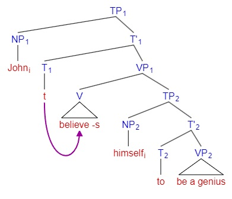

# Binding

The goal of binding theory is to account for the distributions and interpretations of each class of NP. 有了 binding theory 才能解释为什么有些 NP 不能作为某些成分。

## Categories of NPs

NP 分为三种：

* Pronouns: 有 person（人称）、number（数）、gender（性）、case（格）的语法范畴，must get its intended reference from another NP in the same sentence
* Anaphor: reflexives (himself, herself ...), reciprocals (each other), may (not) get its intended reference from another NP in the same sentence. An anaphor must agree with its antecedent in features for gender, number and person.
* R-expressions: names (John, ...), Epithets (the president, the actor, ...) ... non-pronominal NPs with the intrinsic semantics not dependent on the interpretation of some other NPs

Coindexing convention: whenever two NPs have the same index, one is dependent on the other for its interpretation. e.g. $John_i\ hopes\ that\ he_i\ will\ win.$

Antecedent (先行词): an NP that gives its meaning (reference) to a pronoun or anaphor.

## The Binding Principles

不同 NP 有不同的 binding 规则，就好像编程语言中用 public、private 等关键字控制变量的作用域。

Anaphor 和 Antecedent 的位置有什么关系呢？老师在这里带我们对多个句子做了句法分析，逐步找规律并修正句法规则，最后总结：An anaphor should be interpreted as coreferential with a c-commanding phrase in its BD (binding domain).

提出“c-command”这个概念的动机是想要描述“antecedent is structurally higher than the anaphor on the syntax tree”的直觉。We say a node X on a syntax tree c-commands (constituent-command) node Y when:

* X/Y does not dominate Y/X
* The first branching node dominating X dominates Y

We say constituents α binds β iff:

* α is co-indexed with β
* α c-commands β

Chomsky 给的例子：John turned off the motor, but the fool had left the headlight on。这句话中“John”和“the fool”在语义上是 co-refer 的关系，但他们显然没有句法上的关系。剔除掉这些例子之后，我们会发现句法层面上 binding 的句子一定满足 c-command。

The binding domain for an anaphor is the smallest XP containing the anaphor and either:

* a subject other than the anaphor itself or
* a finite T

“John believes himself to be a genius”这个句子中的 himself 是 bind 到 John 上的，因为 John 上面的第一个分支节点是 TP，John c-command 了 himself，而且 himself 处在“Exceptional Case Marking (ECM)”结构中，TP2 里没有一个 finite T，所以 binding domain 可以一直延续到 TP1。而“John believes that himself is a genius”这个句子是错的，因为 himself 在 CP 内，有 finite T，binding domain 到 CP 就结束了。

Subject is the most prominent nominal element in a category, there are subjects:

* of a finite clause: [They]i want to help [each other]i
* of an ECM: They expected [the players]i to help [each other]i
* of an NP: [the coaches]j heard [the players']i stories about [each other]i

When there are more than one potential antecedents, an anaphor is bound by the closest c-commanding subject. That is to say, no subject can intervene between the anaphor and antecedent.

总结完 anaphor 的 binding principle 之后，我们再总结 pronoun 和 R-expression 的：

* A pronoun must be free (not bound, that is to say not coreferential with any c-commanding phrase) in its binding domain
* An R-expression must be free. Although R-expressions can not be syntactically bound, it can still be coreferential with other NPs.

A more recent formulation of Binding Principles by Chomsky:

* Principle A: If α is an anaphor, interpret it as coreferential with a c-commanding phrase in BD.
* Principle B: If α is an pronominal, interpret it as disjoint from every c-commanding phrase in BD.
* Principle C: If α is an R-expression, interpret it as disjoint from every c-commanding phrase.

## Variables, Principle C and Movement

Movement substitutes an element of type X into a c-commanding position of type X, which means the moved NP must bind its trace.

In predicate logic (谓词逻辑) / quantificational phrase (量化短语), for example, "For every x, x a student, x likes pizza", the 2nd x is called the operator, and the last x is called an variable. The operator must c-commands the variable, and the interpretation of the variable must be the same as the operator. Actually the word "bind" comes form logic.
