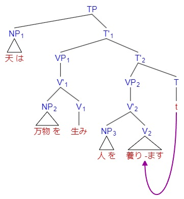

# ZJU Syntax 句法学

浙江大学英语系 2023 年冬学期本科课程《句法学》。程工老师的课堂质量非常高，带着学生像语言学家一样对着详实的语料总结，而且兼顾难度和我们的接受程度。一想到自己因为忙于本专业繁重的课业（主要是因为我试图单刷这学期的 OS lab），纠结还要不要继续学自己感兴趣的语言学，把这门课退了三次又选上三次，差点错过这样的绝世好课，就觉得后怕。

语言是声音和意义由某个介质实现的配对，这个不可见的部件关联了可感知的语音和可理解的意义：Syntax！在这门课中，我们会用平等的态度来分析每一门语言，用科学的方式来描述和解释句法，在精确刻画句法现象的基础上畅想其背后隐藏的人类思维的秘密。

<!-- 在 slides 第 3 节末尾的总结
* Language as a
* 
* 
* 

"I-language" 是内化的知识、能力 -->