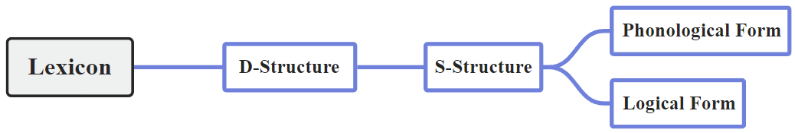
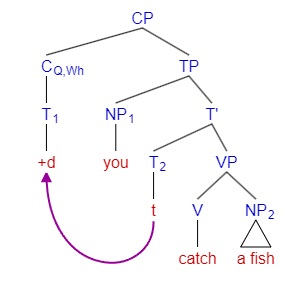

# Universal Grammar

这是最后一章，我们对比分析了不同语言的语法，并且了解了乔姆斯基“Universal Grammar”的愿景

## Syntax beyond English

Three factors that determine the properties of human language:

* Genetic encowments: Universal Grammar
* Experience: particular language(s) we are exposed to
* Third Factors: Principles not specific to the faculty of language. Biological, physical ...

Language only differ in marginal ways. The rule systems of all languages are fundamentally the same.

Parametric Theory: For a specific language, it may use or not to use a specific syntactic feature, which is described as "parameters" defining whether each option is chosen in a specific language.

(1) Verb Position in French & Anglais: T-to-V lowering in English, but V-to-T raising in French, which has been explained in lec5. The V-to-T parameter is on for French, a language more flexible in syntax than English.

* Harry and Hermione [often follow] Filch
* Harry et Hermione [suivent souvent] Rusard

(2) Word order and X' theory: SOV, SVO, ... Based on whether the head comes before or after the complement, the languages are called as head-initial and head-final. The parameter for this difference is the head parameter.

* VO languages (e.g. French) overwhelmingly use preposition（前置介词）, while OV languages (e.g. Japanese) typically use postposition, which is determined by the typical position of head to the complement.
* French uses C-TP, while Japanese uses TP-C
* French uses T(aux.)-VP, while Japanese uses VP-T

There may be languages in between. For example, Chinese has a disharmonic word order, where some categories are head-initial, while others are head-final. Chinese is in the middle of transition from SVO to SOV.

(3) Clausal Typing Hypothesis: 有表示疑问的 particle（吗/呢/か/の）的语言都没有 wh-movement，即都是 wh-in-situ language。particle 和 wh-movement 的功能都是疑问句标记，选择其中一个就行。汉语、日语的疑问语气依赖 particle，所以没有 particle 时，疑问词就会被解释成非疑问语气（张三什么都吃）；而英语、法语没有 particle，靠 wh-movement 提示疑问语气。

## The Architecture of Grammar

There are 3 kinds of rules in syntax:

1. Compositional rules: PS rules & X' theory, rules which generates an infinite array of hierarchically structured expressions.
2. Transformational rules: Movement rules, rules that convert one phrase structure into another
3. Interpretative rules: Binding theory, rules relevant for the semantic interpretation of relations between NP constituents

At the end of this course, we aim to bring together different rules into an overall model of the grammar.

* Inverted Y-Model
* Lexicon (词库): the mental dictionary containing idiosyncratic information about the words in a language
* D-Structure (深层结构): a syntactic representation built by PS-rules in conformity with X' theory
* S-Structure (表层结构): a furthur syntactic representation derived from D-structure by movement rules
* Phonological Form (音系式): the level responsible for converting a syntactic representation (a tree or labelled bracketing) into arepresentation which can be input to phonological, and ultimately, phonetic rules and representations
* Logical Form (逻辑式): the level which converts the syntactic representation into a representation which can be the input to the semantic representation

## Lexicon

The lexicon specifies idiosyncratic information which is associated with lexical items.

C-selection: Each category of the heads selects for different complements. The feature of the head is called the categorial feature, and the feature of the complement is called the subcategorial feature. They can be marked as:

* watch (V) ___ NP
* put (V) ___ NP PP
* say (V) ___ CP

S-selection (semantic selection) is another kind of selection, the specification of the argument structure for each verb. It can be marked as:

* watch (V) ___ <Agent, Theme>
* put (V) ___ <Agent, Theme, Location>
* eat (V) ___ <Agent, (Theme)>

There are verbs that assigns no subject / external thematic role at all. e.g. It __seems__ that the world is round.

Not all categories have s-selection properties. Functional categories, like auxiliaries, are not associated with θ-roles.

## D- and S-Structure

D-sturcture is the level where the syntax just meets the lexicon.

Projection Principle: All and only featural information that is stored in the lexicon must be reflected in the syntax, at all levels of representation.

With the projection principle, we can reinterpretate the D-structure as the syntactic level where lexical items are inserted into phrase markers generated by X' theory in conformity with the projection principle. 乔姆斯基的表述更简短：“D-structure is a representation of θ-role assignment...”

S-structure is a further syntactic representation derived from D-structure by movement rules. D-structure and S-structure are designated collectively as the narrow syntax, which is collected with the lexicon via Projection Principles.

## Phonological Form

The PF and LF are considered as interface levels with the performance system. They are decoupled and do not directly interact, but are collectively designated as the interpretive components, one is responsible for what we hear (sensori-motor), and the other for what we understand (conceptual-intensional).

For the PF, we say syntactic structures are phonologically realized at PF, 比如用语调来体现句法的 hierarchical structure.

There are purely PF operations. e.g. T-to-V movement & do-support are devices to avoid affix stranding. 完全没起到用语法来表意的功能，有这些 movement 纯粹是因为单独一个 tense（比如 -ed）不好发音。

Features of PF Movements:

* Downward movement is allowed, because PF is entirely independent of LF
* Adjunction instead of substitution
* Operates on adjavency rather than c-command

到音系式的层面，句法的 hierarchical structure 已经不存在了，PF movement 只能根据一维距离远近来移动到就近的位置上。

e.g.

* 有 Neg 时，由于一维结构上否定词挡在 tense 和 V 之间，tense 左右两边最近的语素都不能和自己结合，单独的 tense 又难以发音，于是只能凭空产生助动词 do
* 在 subject-auxiliary inversion 中出现 do-support。T-to-C movement is syntactic, whereas do-support is morphological

## Logical Form

LF is the level of representation which forms the input to the semantic component.

wh-movement creates a syntactic configuration in the (overt) S-structure which can be interpreted at LF as one kind of quantificational structure. e.g.

* Which course does Goona like t?
* Interpretation: For which x, x a course, does Goona like x?

在 LF 处诠释句子时，会把量词 raise 到比句子其他部分更高的层次，这个叫 quantifier raising。这会导致一些 ambiguity，例如：

* Everyone loves someone.
* Distributive reading: $[_{TP}Everyone_i[_{TP}someone_j[_{TP}t_i\ loves\ t_j]]]$. ∀ x, ∃ y, x loves y.
* Collective reading: $[_{TP}Someone_j[_{TP}everyone_i[_{TP}t_i\ loves\ t_j]]]$. ∃ x, ∀ y, y loves x.
