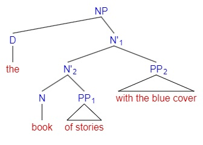

# Phrase-Structure Rules & X' Theory

PS-rules are the formal devices which generate constituent structure, by specifying all and only the possible ways in which categories can combine

## History of Grammar

最古老的传统语法分析：Immediate Constituency Analysis 直接成分分析法。类似初等教育中语文课教的，给句子成分分主谓、述宾、述补、偏正……关系

二十世纪中期的 Formal Science 浪潮中，发生了 a cognitive revolution，诞生了 the computational theory of mind (CTM)。New concept of grammar: grammar is taken as a formal device to generate sentences，被 Chomsky 称为 Finite-State Grammar（正则表达式与有限状态机），后来这个概念被 Shannon 采用，进入信息科学

然后 Chomsky 说：Human language is not a finite-state language. Finite-State Grammar 在遇到一个 loop 时必然遗忘之前的所有 loop，而人类语言是可以产生 anti-missile missile, anti-(anti-missile missile) missile ... 这样的串的，即 $anti^n missle^{n+1}$，需要在后一个 loop 时记得前一个 loop 循环了几轮。这些细节属于形式语言与自动机理论，不学不影响理解 syntax。

> 此时此刻玉泉那边，我计院的 peers 也在《计算理论》课上听这些吧？

## Phrase-Structure Rules

升级改造 finite-state grammar：Phrase-Structure Rules，a kind of Generative Grammar。

$$
\begin{cases}
S → NP\ VP \\
NP → N \\
VP → V \\
N → Mary \\
V → runs \\
\end{cases}
$$

Symbols:

* 每条 rule / derivation 的箭头左边是句法树里的 mother node，右边是 daughter node(s)
* non-terminal symbols: 类似 S NP VP N V 这种，出现在句法树的 non-terminal nodes 上的符号。P 是 phrase，NP、VP 等就是名词、动词的意思
* terminal symbols: 类似 Mary runs 这样具体的单词，出现在句法树的 terminal nodes 上
* VP → V (NP) (PP) 这样的 rule 中，brankets indicate optional categories，也就是说动词短语一定有动词，但可以没有宾语和介词短语

PS-rules provides 3 kinds of information:

* vertical: hierarchical structure
* horizontal: linear precedence
* categorial: the category labels of nodes in a syntax tree

出现在 PS-rules 的某一条 rule 箭头左边的符号，如果出现在另一条 rule 箭头右边，那么这组 PS-rules 可以产生循环的句子，称为 recursion。比如 the box in [the box in [the box in [the box in [the ...]]]]，就是 NP 不断 derivate 出新的 NP。Recursion brings infinity to language.

$$
\begin{cases}
NP → D\ N\ PP\\
PP → Prep\ NP\\
\end{cases}
$$

> Chomsky Hierarchy：当代 AI 还在 finite-state grammar 上运行。上面的 PS grammar 是一种 Context Free Grammar，比 FS / regular grammar 要复杂一个等级，而人类语言是不是 PS grammar 能描述的还有待商榷，因此目前基于 FS grammar 的人工智能只能很像地模仿人类语言，不可能完全一样

## X' Theory

评价语法的标准：

* descriptive / explanatory adequacy 描写/解释充分性，可以解释一门语言的句法，和更加普遍的句法
* endocentric / exocentric 向/离心结构，也就是 XP 里有没有 X（称为 head）成分

之前学的 PS rules 是描写充分的，但不符合解释充分性的要求。它只能描述英语（language-specific），对每种成分都要编写互相无关联的规则（construction-specific），而且不能解释句法背后的心理机制。解释充分性的句法应满足：

* universal
* maximally constrained
* psychologically plausible

X' theory (read as "X-bar theory"，中文叫 X 阶标理论) 是解释充分性的语法，所有语言，所有词类都有类似的规则。

最基本的句法树：$XP→Spec\ [_{X'}X\ C]$。

* X：中心语（head），可以是 V、N 等任意词类
* Spec：标志语（specifier / modifier），表示冠词、very 等联系相对不紧密的修饰语（adjuncts），一般省略掉也不影响句法正确与否，起到一个造型上的作用
* C：补足语（complement），是不可省略的 argument(s)，应该出现的 C 省掉之后句法就不正确了，而且 typically the arguments are categorially selected (C-selected，语类选择) by the head，比如说 X 是及物动词，那么它后面跟的 complement 的词性就得是 NP

以前我们区分“adjunct”和“argument”都是凭语义，在 PS rule 中，不管是 argument 还是 adjunct 都是 head 的 sister node，由 XP 直接分化出来，体现不出 argument 在句法上比起 adjunct 跟 head 的关系更紧密（由 constituency test 确定的）。But in X-bar theory, a structural distinction between arguments and adjuncts can be properly represented. We can treat arguments as sister of X (complement), and adjuncts as sister of X' (specifier).

e.g. a book of poems，PP 是 complement；a book with blue cover，PP 是 specifier / modifier。所以判断是 specifier 还是 complement 不能只看这个 constituent 的词类，最终还是得用 constituent test 来验证到哪里算是一个 XP，其中哪些是联系更紧密的 X'，哪些可以丢到 specifier 里

> 其实上面这个例子我上课的时候没明白为什么“of poems”不能省掉。事后想想，可能 a book of poems 里面 book 是量词，表示“一书的诗歌”而不是“一本诗歌的书”。

X' theory 有 endocentricity（向心性），every phrase should have a head；而理论上 PS rule 并没有限制 NP → V AP 这种荒谬的句法不能出现在其中，它是 exocentric 的。C-select 这种词类搭配的规则叫 categorial features，而 XP 的 categorial features 和下面的 X'、X 必须一样，这种现象叫做 the projection of categorial features。因为 projection 的存在，所以有了这些术语：XP is the maximal projection of X, X' is the intermidiate projection of X, X is the minimal projection (head) of X' and XP。

如果一个短语有多个 specifier 或多个 complement，该如何避免使用多分枝？答案是 XP 可以继续分化出 XP，X' 也可以继续分化出 X'，例如：

## Functional Categories: The Structure of the Clause

这一节讲的问题是，X' theory 对 NP、VP、AP、PP 显然适用，那么它是否可以解释句子和从句？

首先我们从陈述句的 NP Aux VP 结构切入，来思考“句子”到底是个什么种类的 XP。沿着这样的思路尝试应用 X' theory：

1. 最原始的 PS rule：S → NP Aux VP，这不符合 X' schema
2. 也许 Aux 是 specifier V'，而 VP 是 V'？不对，specifier 应该是 optional 的，助动词有没有会严重影响表意；VP 的行为比起 X' 更像 XP；此外，auxiliaries carry sentential information regarding negation and interrogatives，而 Spec V' 不是句子层次的结构
3. 也许可以把句子视为 AuxP，那么就可以得到符合 X' schema 的句法树 $AuxP→NP\ [_{Aux'}Aux\ VP]$。但是把助动词当成句子的中心成分，显然高估了其地位，因为大部分陈述句都没有助动词。每个陈述句都有的，是什么成分？
4. 英语里所有句子都有时态。把 AuxP 重新解释成 TP，其中 T 表示 tense，在有 Aux 的句子中 tense 通过 Aux 表现出来，这样解释就合理多了。

因此，最终我们对陈述语序的句子的解释是：$TP→NP[_{T'}T\ VP]$，英语里的 tense 有 past 和 non-past 两种。$[_{TP}[_{NP}he][_{T'}[_Tshould][_{VP}talk\ to\ this\ man]]]$

对从句、疑问句的解释：它们都是补语化成分（complementizer）短语，CP → Comp TP。从句的引导词和疑问句的疑问词都是补语化成分。Comp（C）的取值可分为 ±Q，表示该引导词是否有疑问语义，比如 whether、that 分别属于 +Q 和 -Q。写成 X' theory 的形式是 $CP→Comp\ [_{C'}C\ TP]$。e.g.

* 从句：$CP→Spec\ [_{C'}[_{C[-Q]}for]\ [_{TP}John\ to\ leave]].$
* 疑问句：$CP→[_{Spec}who][_{C'}[_{C[+Q]}did][_{TP}Mary\ t\ see\ t]]?$

对 non-finite (infinitival) clause 的解释：T 可以取值 -T，表示没有 tense，并且导致 PRO subject，比如 $John\ tried\ [_{S'}[_{TP}[_{NP}PRO_i][_{T'}[_{T}to][_{VP}leave]]]]$。这里的 PRO 用来描述存在 pronoun dropping 现象的句法，表示一个空代词。下标 i 是 co-indexation 标记，表示的是 named entity（终于和 NLP 的知识串起来了！），一个句子中所有下标相同的 constituents 表示的是同一个 co-indexation。

不定式从句还可以根据 PRO subject 指代的对象分为不同的 control sentence：

* Subject control: $John_i\ tried\ [_{S'}[_{TP}PRO_i\ to\ leave]]$
* Object control: $John_i\ persuaded\ Bill_j\ [_{S'}[_{TP}PRO_j\ to\ leave]]$
* Arbitrary control: $It\ is\ difficult\ [_{S'}[_{TP}PRO\ to\ leave]]$

对 Gerundive clause 的解释（gerund：动名词）：$John\ dislikes\ [_{S'}[_{TP}PRO_i\ eating\ in\ public.]]$

英语有两种从句，差别体现在句法上就是从句算 adjunct 还是 argument：

* 补足语从句 complement clause：$NP→[_{Spec}the][_{N'}[_Nsuggestion][_{CP}that\ John\ should\ resign]]$
* 关系从句 relative clause：$NP→[_{Spec}the][_{N'}[_{N'}[_Nsuggestion]][_{CP}that\ John\ made]]$